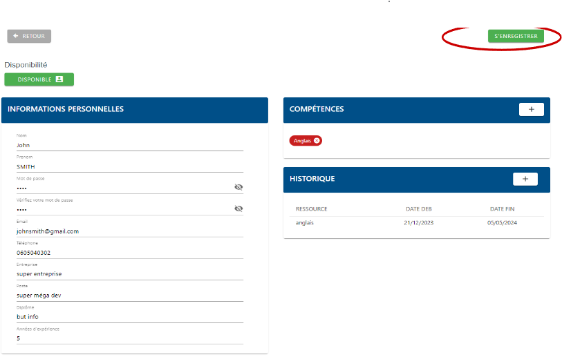

# 2. Configuration

### 2.1. Accéder à l’application

Vous pouvez accéder au site sur votre appareil (téléphone ou pc) via le lien : [https://annuvac.french-heberg.com/](https://annuvac.french-heberg.com/)

### 2.2. Créer son compte

Vous arrivez par défaut sur la page de connexion. Cliquez sur “S’ENREGISTRER”

Cliquez sur “JE SUIS VACATAIRE”

Vous arrivez sur une page où vous pouvez ainsi renseigner vos informations personnelles. Pour plus de détail sur le fonctionnement des compétences et de l’historique, référez vous respectivement aux points [3.2.2.](2.-configuration.md#id-3.2.2) et [3.2.3.](2.-configuration.md#id-3.2.3.-historique-de-ressources)

Une fois que vous avez rempli toutes vos informations, cliquez sur “S’ENREGISTRER”

Une fois votre fiche validée par un administrateur, vous pourrez consulter vos informations et les modifier au besoin.

### 2.3. Se connecter à son compte

Renseignez votre email et mot de passe puis cliquez sur “SE CONNECTER”.

Vérifiez bien que “vacataire” soit écrit à côté du petit bouton switch, sinon cliquez dessus.

##
