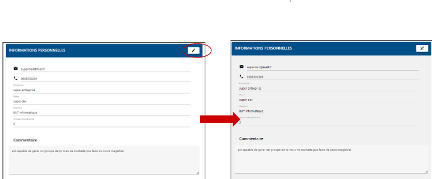

# 3. Vue d'ensemble

### 3.1. **Menu**

### 3.2. **Mettre à jour sa fiche détaillée**

ATTENTION, merci de cliquer sur le bouton “SAUVEGARDER” après avoir effectué vos modifications.

#### 3.2.1. **Informations personnelles**

Cliquez sur le bouton avec l’icône de modification pour pouvoir modifier le panel d’informations personnelles.

#### 3.2.2. **Compétences** 

Cliquez sur le bouton avec l’icône de modification pour pouvoir modifier le panel de compétences.

**3.2.2.1. Ajouter**

Cliquez sur le bouton “+” pour ajouter une nouvelle compétence

Une pop-up s’affiche à l’écran. Vous pouvez ainsi choisir les compétences qui vous conviennent en cliquant sur celles-ci dans la liste.

Vous pouvez également effectuer une recherche parmi les compétences pour plus d'efficacité.

Une fois que vous avez sélectionné vos compétences, cliquez sur le bouton “AJOUTER”.

**3.2.2.2. Supprimer**

Cliquez sur le “x” sur la compétence à supprimer pour la retirer.

#### 3.2.3. **Historique de ressources**

Cliquez sur le bouton avec l’icône de modification pour pouvoir modifier le panel de l'historique.

**3.2.3.1. Ajouter**

Cliquez sur le bouton “+” pour ajouter une nouvelle ressource

Une pop-up apparaît à l’écran. Une fois les informations remplies, cliquez sur “AJOUTER”.

**3.2.3.2. Modifier**

Cliquez sur la ligne correspondant à la ressource à modifier.

Une pop-up apparaît à l’écran. Une fois vos modifications réalisées, cliquez sur “METTRE À JOUR”.

**3.2.3.3. Supprimer**

Cliquez sur la ligne correspondant à la ressource à supprimer.

Une pop-up apparaît à l’écran. Cliquez sur “SUPPRIMER”.

#### 3.2.4. **Modifier son état**

Cliquez sur le bouton indiquant votre état sur la page de fiche personnelle pour le modifier

**3.2.4.1. Disponible**

Cet état indique que vous pouvez être contacté pour effectuer une vacation.

**3.2.4.2. Indisponible**

Cet état indique que vous ne serez pas contacté pour effectuer une vacation tant que vous resterez indisponible. Pour complètement supprimer vos données, référez vous au point 3.4

**3.2.4.3. Neutre**

Cet état indique que vous pouvez ou non être contacté pour effectuer une vacation.

### 3.3. **Enregistrer ses informations**

Après avoir effectué des modifications sur votre fiche, vous pouvez les sauvegarder en cliquant sur le bouton “SAUVEGARDER”. La sauvegarde n'est pas automatique, si vous quittez la page sans sauvegarder, vos changements ne seront pas enregistrés.

### 3.4. **Supprimer son compte**

Veuillez contacter un administrateur qui supprimera votre compte pour vous en base de données.

Si vous souhaitez juste indiquer de ne pas être contacté pour une vacation, vous pouvez vous référer à l’état indisponible vu au point [3.2.4.](3.-vue-densemble.md#id-3.2.4.-modifier-son-etat)
