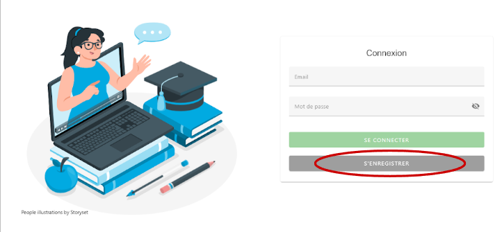

# Documentation utilisateur vacafun

**INSTITUT UNIVERSITAIRE D’INFORMATIQUE - ANNÉE 2023 - 2024**
**PROJET ANNUAIRE POUR VACATAIRES**
**DOCUMENTATION UTILISATEURS**

> Version 1.0

> Auteurs :
>
> * Laurane MOURONVAL
> * Gauthier CORION

> **UNIVERSITÉ DU LITTORAL CÔTE D’OPALE**\
> **IUT CALAIS-BOULOGNE**\
> **Rue Louis David - 62100 CALAIS**\
> **Téléphone (33) 03.21.19.06.60 Télécopie (33) 03.21.19.06.61**

### CONTRÔLE DU DOCUMENT

#### Historique des versions

| Date       | Version | Auteur                                           | Principales modifications              |
| ---------- | ------- | ------------------------------------------------ | -------------------------------------- |
| 14/11/2023 | 1.0     | Laurane MOURONVAL                                | Première rédaction de la documentation |
| 18/01/2023 | 2.0     | <p>Laurane MOURONVAL<br>Gauthier CORIONORION</p> | Ajouts d'éléments et correction        |

#### **Distribution**

L’équipe de développement.

#### **Sécurité et confidentialité**

```
Tout salarié de VacaFun est tenu au secret des savoir-faire de l’entreprise en vertu de l’article L. 1227-1 du Code du Travail.


Toutes actions entreprises doivent être conformes au Règlement Général sur la Protection des données (RGPD). Ainsi, il est obligatoire de garantir une information concise, transparente et compréhensible au client.


Copyright aux auteurs.
```


## 1. PRÉSENTATION DU DOCUMENT

### 1.1. But du document;

Le but de ce document est de synthétiser l’ensemble des fonctions qu’a le projet d’Annuaire de Vacataires. Cette notice permettra aux vacataires de créer leur compte avec facilité et ensuite le gérer de manière complètement autonome.

### 1.2 Cadre du document

Ce document a été réalisé pour répondre aux besoins exprimés par la cliente Mme Fernandez.


## 2. CONFIGURATION

### 2.1. Accéder à l’application

Vous pouvez accéder au site sur votre appareil (téléphone ou pc) via le lien : [https://annuvac.french-heberg.com/](https://annuvac.french-heberg.com/)

### 2.2. Créer son compte

Vous arrivez par défaut sur la page de connexion. Cliquez sur “S’ENREGISTRER”



Cliquez sur “JE SUIS VACATAIRE”

Vous arrivez sur une page où vous pouvez ainsi renseigner vos informations personnelles. Pour plus de détail sur le fonctionnement des compétences et de l’historique, référez vous respectivement aux points [3.1.2](broken-reference) et [3.1.3](broken-reference) .

Une fois que vous avez rempli toutes vos informations, cliquez sur “S’ENREGISTRER”

Une fois votre fiche validée par un administrateur, vous pourrez consulter vos informations et les modifier au besoin.


### 2.3. Se connecter à son compte

Renseignez votre email et mot de passe puis cliquez sur “SE CONNECTER”.

Vérifiez bien que “vacataire” soit écrit à côté du petit bouton switch, sinon cliquez dessus.


## 3. VUE D'ENSEMBLE

    ***

### 3.1. **Menu**

    ***

### 3.2. **Mettre à jour sa fiche détaillée**

    ATTENTION, merci de cliquer sur le bouton “SAUVEGARDER” après avoir effectué vos modifications.

    ***

####   **Informations personnelles**

        Cliquez sur le bouton avec l’icône de modification pour pouvoir modifier le panel d’informations personnelles

    ***

####   **Compétences**

        Cliquez sur le bouton avec l’icône de modification pour pouvoir modifier le panel de compétences.

        ***

#####   **Ajouter**

            Cliquez sur le bouton “+” pour ajouter une nouvelle compétence

            Une pop-up s’affiche à l’écran. Vous pouvez ainsi choisir les compétences qui vous conviennent en cliquant sur celles-ci dans la liste.

            Vous pouvez également effectuer une recherche parmi les compétences pour plus d'efficacité.

            Une fois que vous avez sélectionné vos compétences, cliquez sur le bouton “AJOUTER”.

        ***

#####   **Supprimer**

            Cliquez sur le “x” sur la compétence à supprimer pour la retirer.

    ***

####   **Historique de ressources**

        Cliquez sur le bouton avec l’icône de modification pour pouvoir modifier le panel de compétences

        ***

#####   **Ajouter**

            Cliquez sur le bouton “+” pour ajouter une nouvelle ressource

            Une pop-up apparaît à l’écran. Une fois les informations remplies, cliquez sur “AJOUTER”.

        ***

#####   **Modifier**

            Cliquez sur la ligne correspondant à la ressource à modifier.

            Une pop-up apparaît à l’écran. Une fois vos modifications réalisées, cliquez sur “METTRE À JOUR”.

        ***

#####   **Supprimer**

            Cliquez sur la ligne correspondant à la ressource à supprimer.

            Une pop-up apparaît à l’écran. Cliquez sur “SUPPRIMER”.

    ***

####   **Modifier son état**

        Cliquez sur le bouton indiquant votre état sur la page de fiche personnelle pour le modifier

        ***

#####   **Disponible**

            Cet état indique que vous pouvez être contacté pour effectuer une vacation.

        ***

#####   **Indisponible**

            Cet état indique que vous ne serez pas contacté pour effectuer une vacation tant que vous resterez indisponible.

            Pour complètement supprimer vos données, référez vous au point [3.4](broken-reference)

        ***

#####   **Neutre**

            Cet état indique que vous pouvez ou non être contacté pour effectuer une vacation.

        ***

### 3.3. **Enregistrer ses informations**

    Après avoir effectué des modifications sur votre fiche, vous pouvez les sauvegarder en cliquant sur le bouton “SAUVEGARDER”. La sauvegarde n'est pas automatique, si vous quittez la page sans sauvegarder, vos changements ne seront pas enregistrés.

        ***

### 3.4. **Supprimer son compte**

    Veuillez contacter un administrateur qui supprimera votre compte pour vous en base de données.

    Si vous souhaitez juste indiquer de ne pas être contacté pour une vacation, vous pouvez vous référer à l’état indisponible vu au point [Indisponible](broken-reference)
